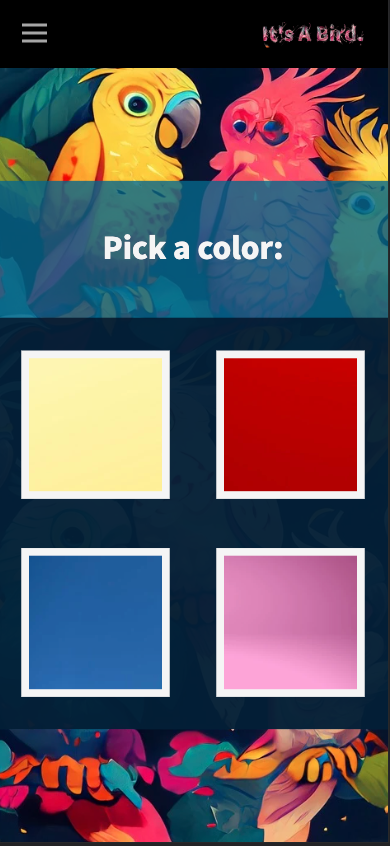
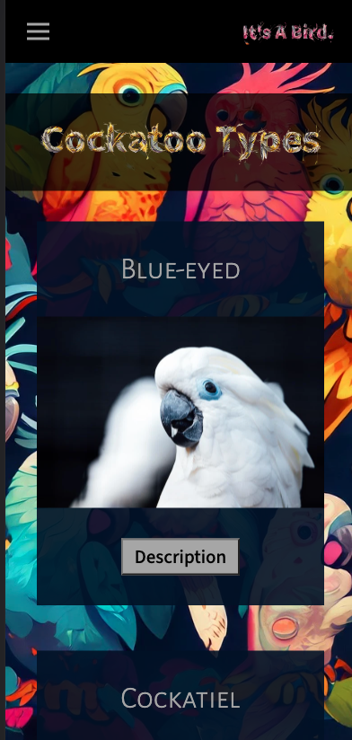
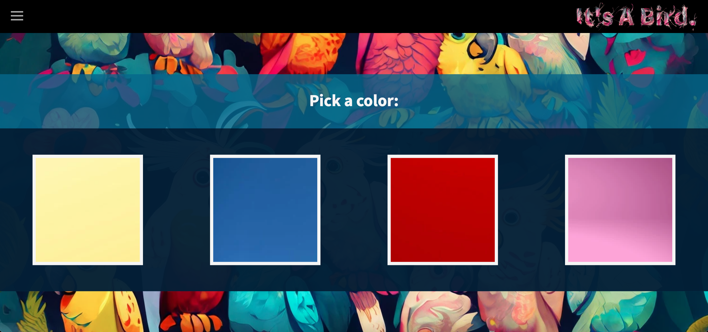
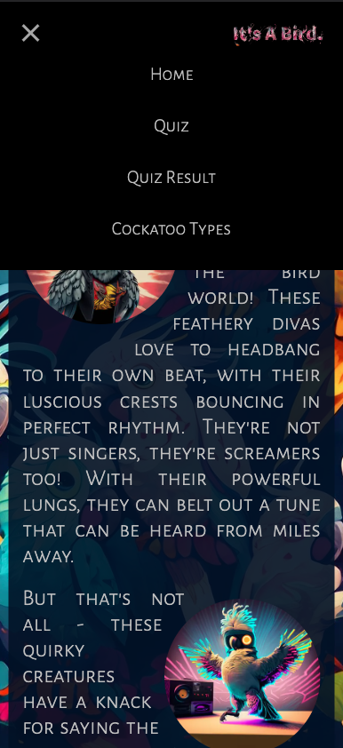
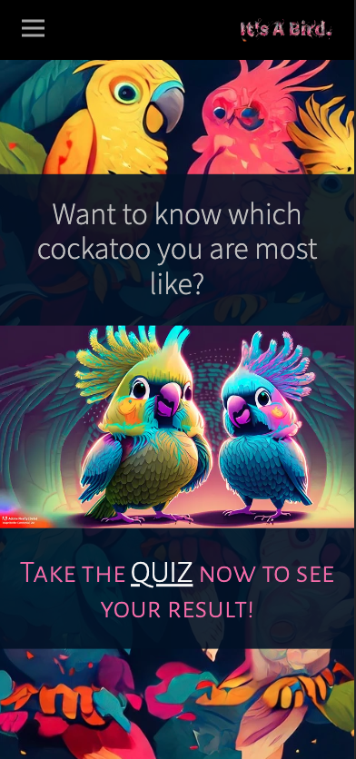

# It'a A Bird

---

## Description
This project was created to complete a Codecademy portfolio project for the Front-End Engineer career path.  It uses react and redux to make a fun website about cockatoos.  Users can read about different types of cockatoos and take a quiz to see which cockatoo they are most like. 

---

## Features
*  __Responsive__:  Flexbox design and responsive images allow the website to look great on any device. 

Mobile Layout

Desktop Layout

*  __Easy to use__: Navigation bar has a hamburger style menu to navigate the site.  If a user navigates to the quiz result page before taking the quiz, they are directed to take the quiz first to see their result.  Redux Persist ensures quiz answers and result are saved even when the site is refreshed.  Simply clicking the images in the quiz saves the answer and moves to the next question.  

*  __Cohesive Design__: The site is made cohesive by using the same background image on each page.  Also, colors from the background are used throughout the site as well as similar layout designs for the pages.

## How to Use
Simply open [It's A Bird](https://its-a-bird.netlify.app/) in any browser to use the website.

---

## Technologies
* node.js: 19.8.1
* react: 18.2.0
* react-dom: 18.2.0
* react-scripts: 5.0.1
* react-router-dom: 6.10.0
* react-redux: 8.0.5
* reduxjs/toolkit: 1.9.3
* redux-persist: 6.0.0
* web-vitals: 2.1.4
* testing-library/jest-dom: 5.16.5
* testing-library/react: 13.4.0
* testing-library/user-event: 14.4.3
* normalize.css: 8.0.1
* slugify: 1.6.6
* unslugify: 1.0.3
* javascript
* html
* css
* markdown

---

# Getting Started with Create React App and Redux

This project was bootstrapped with [Create React App](https://github.com/facebook/create-react-app), using the [Redux](https://redux.js.org/) and [Redux Toolkit](https://redux-toolkit.js.org/) template.

## Available Scripts

In the project directory, you can run:

### `npm start`

Runs the app in the development mode.\
Open [http://localhost:3000](http://localhost:3000) to view it in your browser.

The page will reload when you make changes.\
You may also see any lint errors in the console.

### `npm test`

Launches the test runner in the interactive watch mode.\
See the section about [running tests](https://facebook.github.io/create-react-app/docs/running-tests) for more information.

### `npm run build`

Builds the app for production to the `build` folder.\
It correctly bundles React in production mode and optimizes the build for the best performance.

The build is minified and the filenames include the hashes.\
Your app is ready to be deployed!

See the section about [deployment](https://facebook.github.io/create-react-app/docs/deployment) for more information.

### `npm run eject`

**Note: this is a one-way operation. Once you `eject`, you can't go back!**

If you aren't satisfied with the build tool and configuration choices, you can `eject` at any time. This command will remove the single build dependency from your project.

Instead, it will copy all the configuration files and the transitive dependencies (webpack, Babel, ESLint, etc) right into your project so you have full control over them. All of the commands except `eject` will still work, but they will point to the copied scripts so you can tweak them. At this point you're on your own.

You don't have to ever use `eject`. The curated feature set is suitable for small and middle deployments, and you shouldn't feel obligated to use this feature. However we understand that this tool wouldn't be useful if you couldn't customize it when you are ready for it.

## Learn More

You can learn more in the [Create React App documentation](https://facebook.github.io/create-react-app/docs/getting-started).

To learn React, check out the [React documentation](https://reactjs.org/).
